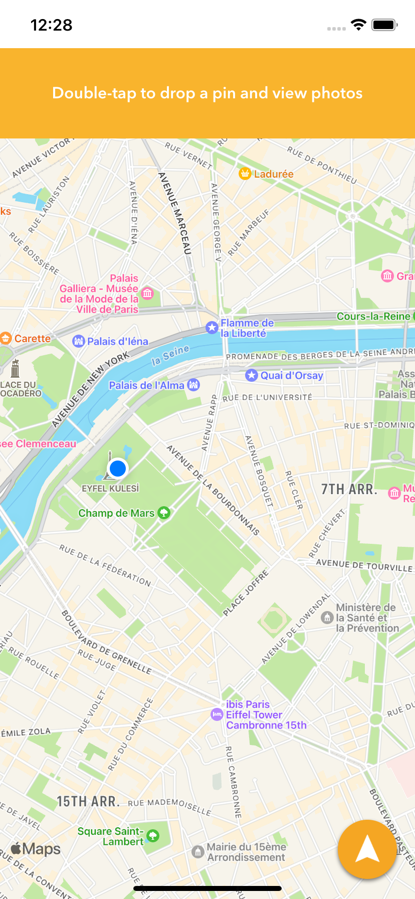
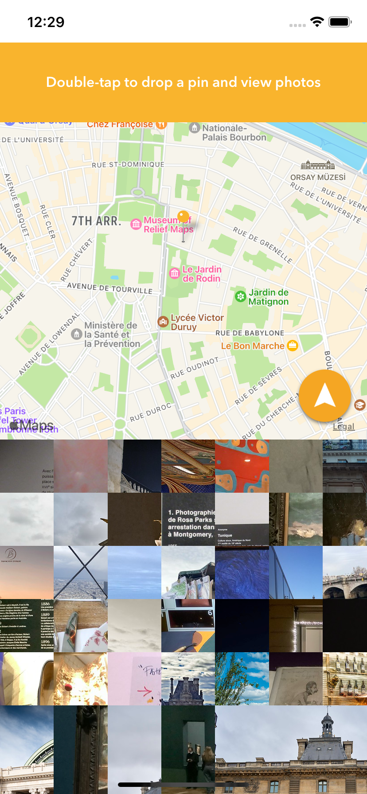
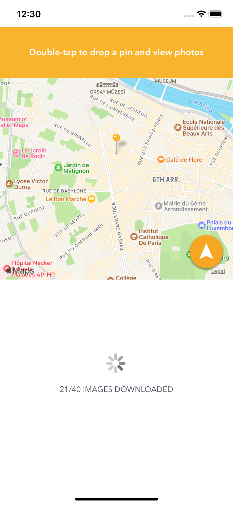
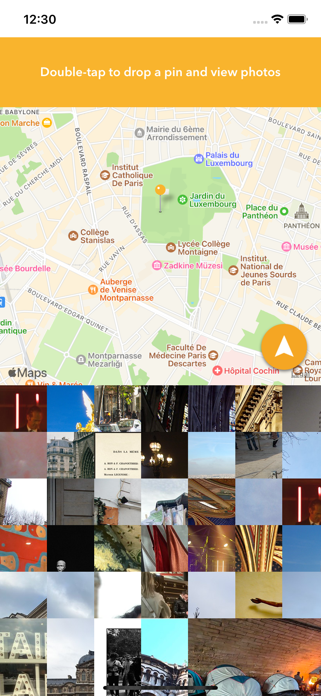
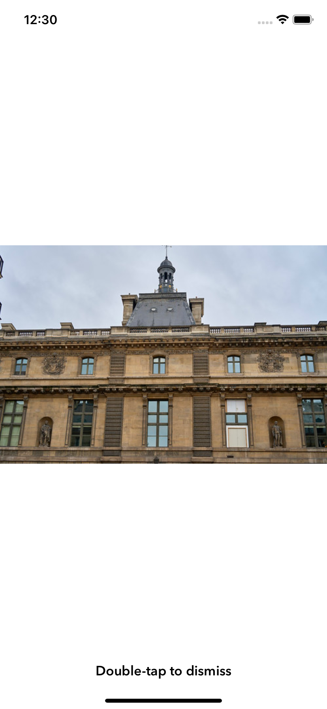
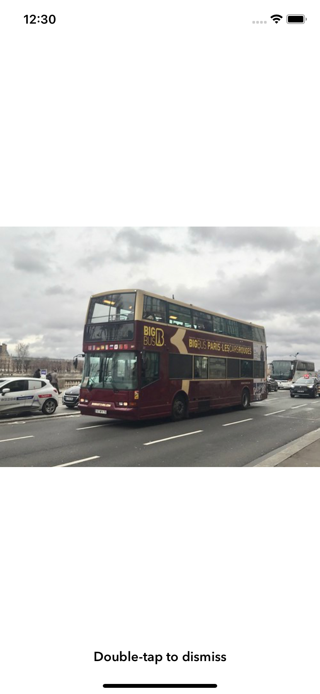

# Pixel City App

13th swift project

  
  

  
  

  
  
<div

Note to self: 
mapkit kullanıldı
annotation eklendi for mapkit
custom pin yapma
spinner ekleme
json parsing
flickerdan url ile resim download
alamofire ile resim download etme
3d touch
